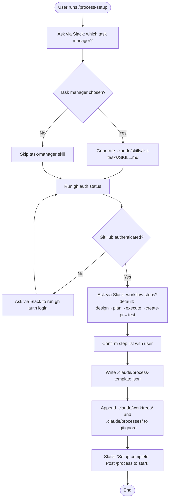
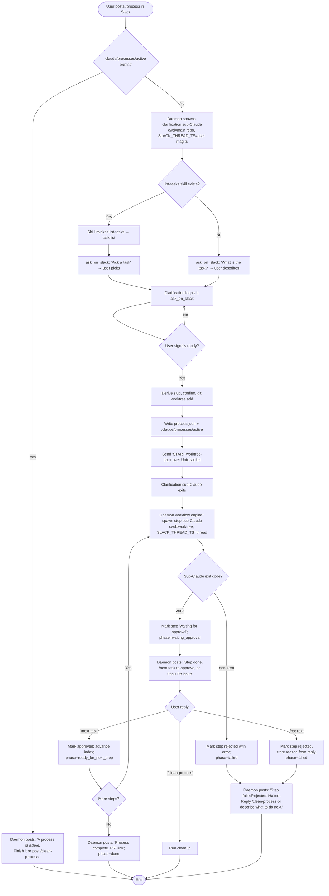
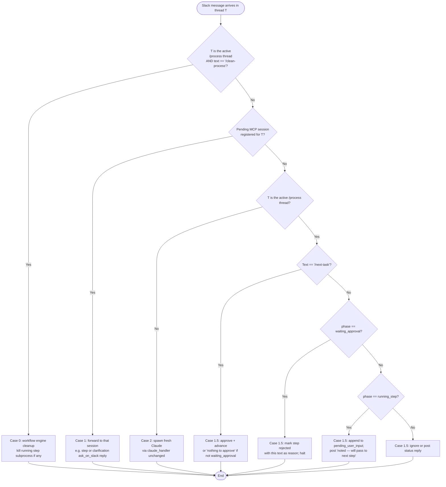

# Full-Process Plugin — Design

A Claude Code plugin that drives an entire feature-development workflow (clarify → design → plan → execute → PR → test) over Slack, using the existing `claude-slack-bridge` MCP server as the communication channel.

The plugin lives **inside this repo** under `/plugin`, runs **one feature at a time**, stores per-feature state **inside each git worktree**, keeps **all messages for one feature in one Slack thread**, and **stops on rejection** to wait for explicit instructions.

---

## 1. Goals

- The whole workflow for one feature happens in **one Slack thread**, even though each step runs in its own short-lived `claude -p` session.
- All human checkpoints (clarifications, approvals, rejections) happen in Slack via `ask_on_slack`. Both the clarification phase and any individual step can ask the user a question — every message lands in the same thread.
- Every workflow step is a real Claude Code skill or slash command — no free-form prose execution.
- Each step runs in its own sub-Claude with `cwd` set to the worktree, so step skills can be written for a normal repo (no worktree-path gymnastics).
- State is a single JSON file per feature, lives in the worktree, deleted with `/clean-process`.
- **There is no long-lived "orchestrator" Claude session.** The Python daemon owns the workflow state machine; Claude is invoked only when reasoning is actually required (clarification, individual steps).
- Workflow steps are defined once during setup and reused for every new feature in the repo.

---

## 2. Architecture

The work is split between **deterministic Python (the daemon)** and **reasoning Claude (sub-sessions)**. Routing, state mutation, subprocess spawning, and approval handling are pure state-machine work and live in the daemon. Anything that needs a model — the upfront clarification conversation and each step's actual execution — runs as a short-lived `claude -p`.

```
                                ┌───────────────────────────────────────┐
   Slack channel  ─── routes ──►│ slack_daemon (this repo)              │
   (per projects.json)          │  • Slack I/O                          │
                                │  • Thread router (Case 1.5)           │
                                │  • Workflow engine (state machine)    │
                                │  • Sub-Claude spawner                 │
                                └───────┬────────────────────┬──────────┘
                                        │ subprocess         │ subprocess
                                        ▼                    ▼
                ┌──────────────────────────────┐  ┌──────────────────────────────┐
                │ Clarification sub-Claude     │  │ Step sub-Claude (one per     │
                │ cwd = main repo              │  │ step, daemon spawns N of     │
                │ Skill: /process              │  │ these in sequence)           │
                │                              │  │ cwd = .claude/worktrees/<f>  │
                │ Drives clarify→slug→ack,     │  │ Skill: @design / @plan / ... │
                │ writes process.json,         │  │ May call ask_on_slack for    │
                │ exits.                       │  │ mid-step questions.          │
                └──────────────────────────────┘  └──────────────────────────────┘
```

**Daemon responsibilities** (new):

1. Detect that a top-level Slack message is `/process` and start the workflow.
2. Spawn the clarification sub-Claude, then on its exit, spawn step sub-Claudes one at a time per `process.json`.
3. Route incoming Slack messages on a `/process` thread (see §7) — to a registered MCP session, to the workflow engine as approval/rejection, or queue for the next step.
4. Mutate `process.json` (advance step, record rejection, queue user input).
5. Post templated approval prompts on step completion. Post step-failure messages on non-zero exit.
6. Hand the right `thread_ts` to every spawned sub-Claude so all `ask_on_slack` calls land in the same thread.

**Sub-Claude responsibilities** (slim):

- Clarification sub-Claude: have the upfront conversation, decide a slug, write `process.json`, exit. Optionally creates the worktree itself (or signals the daemon to do it — see §8).
- Step sub-Claudes: do the step's actual work. Optionally call `ask_on_slack` for mid-step clarifications. Exit with a one-line summary on success, non-zero on failure.

**Sub-Claudes do NOT** drive the loop, decide what step is next, mutate `process.json`'s top-level workflow state, or post approval prompts. That's the daemon.

This factoring sidesteps the original design's three pain points:

1. No long-lived Claude session means no concurrency-inside-Claude problem (no need to "listen on Slack while spawning a subprocess").
2. The daemon's `cwd` doesn't matter — it spawns each sub-Claude with the right `cwd` for that phase (main repo for clarify, worktree for steps).
3. Existing/community skills (`/plan`, `/design`, etc.) still see `cwd = project root`, exactly as they expect.

---

## 3. Plugin Layout

```
plugin/
├── plugin.json                       # Plugin manifest (name, version, skills it ships)
├── skills/
│   ├── process-setup/                # One-time setup flow
│   │   └── SKILL.md
│   └── process/                      # Clarification phase + handoff to daemon
│       └── SKILL.md
└── templates/
    └── task-manager.md.tmpl          # Generated into .claude/skills/list-tasks/SKILL.md (optional)
```

The plugin **ships** two skills (`process-setup`, `process`) and **generates** an optional task-manager helper skill into the consumer repo at setup time.

The original design's `/next-task` and `/clean-process` slash commands are **gone** — they're now string-matched by the daemon directly when a user posts them in a `/process` thread (see §9). Removing them removes a layer of indirection and a generation step.

---

## 4. Files Written Into the Repo at Setup

| Path | Purpose | Owner |
|---|---|---|
| `.claude/process-template.json` | Ordered list of workflow steps for this repo | Setup (re-run setup to edit) |
| `.claude/skills/list-tasks/SKILL.md` | Optional sub-skill that fetches tasks from the user's task manager | Generated by setup if a task manager is detected |

Files written at runtime:

| Path | Purpose | Writer |
|---|---|---|
| `.claude/processes/active` | Marker file in the **main repo**: contains the path to the active worktree. Existence enforces single-active-process. | `/process` skill at end of clarification |
| `<worktree>/.claude/process.json` | Live state of the in-progress feature. | `/process` skill creates it; daemon mutates it as the workflow advances |

Worktrees follow Claude convention: `.claude/worktrees/<feature>/` (sibling to `.claude/processes/`). Both are added to `.gitignore` by setup.

---

## 5. process-template.json (repo-level)

Saved once by setup; copied into each worktree's `process.json` when a feature starts.

```json
{
  "version": 1,
  "branch_pattern": "feature/{slug}",
  "steps": [
    { "name": "design",     "skill": "@design"      },
    { "name": "plan",       "skill": "@plan"        },
    { "name": "execute",    "skill": "@execute"     },
    { "name": "create-pr",  "skill": "@create-pr"   },
    { "name": "test",       "skill": "@test"        }
  ]
}
```

`skill` is either `@<skill-name>` (invoked as `/skill <name>` inside the sub-Claude) or `/<command-name>` (invoked as that slash command). The user picks the steps and their order during setup.

---

## 6. process.json (per-worktree, live state)

```json
{
  "feature": "user-channel-access-control",
  "branch": "feature/user-channel-access-control",
  "worktree": ".claude/worktrees/user-channel-access-control",
  "task_source": "linear:ENG-482",
  "task_description": "Restrict /next-task to authorized Slack users",

  "slack_channel": "C12345678",
  "slack_thread_ts": "1714124312.000200",

  "phase": "running_step",
  "current_step_index": 2,
  "current_step_pid": 48213,
  "pending_user_input": [],
  "pr_link": null,

  "steps": [
    { "name": "design",    "status": "approved",            "skill": "@design",    "rejection_reason": null },
    { "name": "plan",      "status": "approved",            "skill": "@plan",      "rejection_reason": null },
    { "name": "execute",   "status": "in progress",         "skill": "@execute",   "rejection_reason": null },
    { "name": "create-pr", "status": "not started",         "skill": "@create-pr", "rejection_reason": null },
    { "name": "test",      "status": "not started",         "skill": "@test",      "rejection_reason": null }
  ]
}
```

**phase** (top-level state machine cursor): `clarifying` | `running_step` | `waiting_approval` | `done` | `failed`.

**Step status values**: `not started` | `in progress` | `waiting for approval` | `approved` | `rejected`.

**slack_thread_ts** is captured during clarification (the user's `/process` message ts becomes the thread root) and is the single source of truth for "where do all messages for this feature go." The daemon reads it before every sub-Claude spawn and injects it into the spawn's environment.

**pending_user_input** is a queue: if the user posts something in the thread while a step is mid-run and not blocked on `ask_on_slack`, the daemon appends it here and the next step or approval prompt picks it up.

**current_step_pid** lets the daemon (or `/clean-process`) kill the running step subprocess on demand.

---

## 7. Sub-Claude Invocation

For every sub-Claude (clarification or step), the daemon runs:

```
claude -p \
  --plugin-dir <plugin-path> \
  --dangerously-skip-permissions \
  --output-format json \
  --add-dir <main-repo-path> \
  "<phase-specific prompt>"
```

with:
- `cwd = main repo` for the clarification sub-Claude,
- `cwd = <worktree-absolute-path>` for step sub-Claudes,
- `env["SLACK_THREAD_TS"] = process.json["slack_thread_ts"]` (set by the daemon for every spawn after clarification has captured the thread; for the very first clarification spawn, the daemon already knows the thread because the user's `/process` message ts is the thread root — see §8.2).

Notes:
- `--plugin-dir` — passes the same plugin into the sub-Claude so it can resolve `@design`, `@plan`, etc. (matches how the daemon already invokes Claude in [claude_handler.py:174-187](src/claude_handler.py#L174-L187)).
- `--dangerously-skip-permissions` — required for non-interactive `-p` mode; matches the daemon's existing pattern.
- `--add-dir <main-repo-path>` — lets step sub-Claudes read repo-wide artifacts (e.g. `.claude/process-template.json`, `.claude/processes/active`) without leaving the worktree.
- `--output-format json` — daemon parses the result event to detect success/failure (same parser as [`claude_handler._parse_response`](src/claude_handler.py#L233-L253)).
- `SLACK_THREAD_TS` — the bridge MCP gets it. The `SessionBroker` is extended (see §11) to read `os.getenv("SLACK_THREAD_TS")` at startup and seed `_thread_ts` from it. Result: the sub-Claude's first `ask_on_slack` posts as a reply to the existing thread instead of opening a new one.

### 7.1 The step spawn prompt (framing)

The step prompt is templated and built by the daemon. It must do four things so that any community skill (`@plan`, `@design`, etc.) — which has no native awareness of `/process` — behaves correctly inside the workflow:

1. **State the framing.** Tell the model it is running a specific named step of an active `/process`, so it can self-identify in any user-facing message.
2. **Point at the context file.** `process.json` lives in `cwd` and contains task description, prior step artifacts, slug, etc. The skill reads it *before* starting work.
3. **Constrain artifact location.** All outputs go inside the worktree (which is `cwd`). No writes to the main repo.
4. **Set the user-facing identity.** When calling `ask_on_slack`, prefix the message with `[Step: <name>]` so the user reading the Slack thread knows which step is asking.

The template the daemon assembles for each step:

> You are running step **`<step.name>`** of an active `/process` workflow.
>
> **Context.** Read `.claude/process.json` first — it contains `task_description`, `slack_thread_ts`, prior step artifacts, and the feature slug. Do not modify it; the daemon owns it.
>
> **Your job.** Run the skill `<step.skill>` for this feature. Save any artifacts you produce inside this worktree (your `cwd`).
>
> **If you need clarification from the user.** Call `ask_on_slack`. Your message will land in the existing Slack thread automatically. **Prefix every message with `[Step: <step.name>]`** so the user knows it's coming from this step. Do not call `ask_on_slack` for things you can decide yourself — only for genuine clarifications.
>
> **On completion.** Return a one-line summary describing what you produced. Exit zero on success, non-zero with an error message on failure.

`<step.name>` and `<step.skill>` are substituted from `process.json["steps"][current_step_index]`. The clarification sub-Claude gets a similar but distinct template (no step name; framing is "you are running clarification for a new `/process`").

The daemon captures stdout, parses the result, and:
- On success → marks the step `waiting for approval`, posts the approval prompt to Slack.
- On non-zero exit / parse failure → marks the step `rejected` with the error, halts.

---

## 8. The Two Plugin Skills

### 8.1 `/process-setup` — one-time per-repo configuration

Triggered by the user once, after installing the plugin. Runs in a normal Claude session (the daemon spawns it like any other Slack-driven Claude conversation; the user invokes the skill from there).

Responsibilities:
1. Detect a task manager. Ask via `ask_on_slack` which one (Linear / Jira / GitHub Issues / Notion / none). If chosen, generate `.claude/skills/list-tasks/SKILL.md` with concrete instructions for hitting that system's CLI/API.
2. Verify GitHub connectivity (`gh auth status`). If missing, prompt the user via Slack to run `gh auth login`, then re-check.
3. Ask the user for their AI workflow steps. Default suggestion: `design → plan → execute → create-pr → test`. User can add, remove, reorder.
4. Write `.claude/process-template.json` with the chosen steps.
5. Append `.claude/worktrees/` and `.claude/processes/` to `.gitignore` if missing.
6. Confirm in Slack: "Setup complete. Post `/process` in this channel to start a feature."

### 8.2 `/process` — clarification + handoff

Triggered by the user posting `/process` (or `@bot /process`) as a top-level message in a project channel. The daemon's message handler recognises the literal `/process` and:

1. **Refuses if a process is already active** (`.claude/processes/active` exists). Posts "A process is active — finish it or post `/clean-process`." in a reply, returns.
2. Otherwise spawns the **clarification sub-Claude**: `cwd = main repo`, `env["SLACK_THREAD_TS"] = <ts of the user's /process message>`, prompt = "Run the `/process` clarification skill."

The `/process` skill itself (running inside that sub-Claude) does the reasoning work:

1. **Acquire the task** — if `list-tasks` skill exists, invoke it (in-session, via Skill tool — task listing doesn't need the worktree) and ask the user via Slack to pick one; otherwise ask "what is the task?".
2. **Clarification loop** — ask follow-up questions via `ask_on_slack` until the user signals ready. (All these messages land in the existing thread because `SLACK_THREAD_TS` was injected.)
3. **Derive a feature slug** from the task title; confirm with the user.
4. **Create the worktree**: `git worktree add .claude/worktrees/<feature> -b feature/<feature>`.
5. **Materialize state** — copy `.claude/process-template.json` → `<worktree>/.claude/process.json`, fill in feature/branch/task fields, set `slack_channel` and `slack_thread_ts`, set `phase = "clarifying"` → flip to `"running_step"` once written, mark step 0 `in progress`.
6. **Write `.claude/processes/active`** in the main repo, containing the worktree path.
7. **Notify the daemon**: send a one-line message over the Unix socket — `START <worktree-path>\n` (a new verb alongside the existing `REGISTER`). The daemon's workflow engine picks it up and begins the step loop.
8. **Exit** with a short success summary.

From step 7 onward, **no long-lived Claude session exists for this feature**. The daemon drives everything until completion or `/clean-process`.

---

## 9. Daemon-Side Workflow Engine

Replaces the original `/next-task` and `/clean-process` Claude slash commands. The daemon recognises them as literal text in any active `/process` thread and handles them in Python.

### 9.1 Step loop (driven by the workflow engine)

Triggered by `START <worktree>` from `/process`, and again on every state transition (step approval, user reply, etc.).

```
loop:
  load process.json
  if phase == "done" or "failed": return
  if phase == "running_step":
    # Already running — do nothing, the subprocess-exit handler will fire next.
    return
  if phase == "waiting_approval":
    # Waiting for /next-task or rejection — do nothing.
    return
  # phase == "ready_for_next_step" (set by the approval handler)
  step = steps[current_step_index]
  step.status = "in progress"
  phase = "running_step"
  save process.json
  spawn sub-Claude (cwd=worktree, SLACK_THREAD_TS=<ts>, prompt = "run skill <step.skill>")
  record current_step_pid
  attach exit handler:
    on clean exit: step.status = "waiting for approval"; phase = "waiting_approval"
                   post "Step <name> done. Reply /next-task to approve, or describe the issue."
                   if pending_user_input is non-empty, append it to the approval prompt.
    on non-zero:   step.status = "rejected"; step.rejection_reason = <stderr summary>
                   phase = "failed"
                   post "Step <name> failed. <error>. Halted."
```

### 9.2 Slack message router (revised precedence)

The router needs to handle one new wrinkle: a step sub-Claude can be blocked on `ask_on_slack` (registered in `_pending`), and a user reply during that window should normally go to the step — **except** for emergency-stop control commands that must always reach the workflow engine. So `/clean-process` is lifted to **Case 0** (before the existing Case 1 pending-session forward); `/next-task` and other workflow signals stay in Case 1.5 (after Case 1, since they're nonsensical mid-step anyway).

Revised order in `_handle_slack_message`:

```
text_stripped = text.strip() if thread_ts else ""
process_thread = thread_ts and thread_ts is the active /process thread

# Case 0 (NEW): emergency-stop control commands always reach the workflow engine,
# even if a step sub-Claude is currently blocked on ask_on_slack. Without this,
# Case 1 would forward "/clean-process" into the step as if it were a clarification answer.
if process_thread and text_stripped == "/clean-process":
  run cleanup (see §9.3)
  return

# Case 1 (UNCHANGED): pending MCP session registered for this thread → forward.
# Catches mid-step ask_on_slack replies and clarification-phase replies.
if thread_ts and pending session exists:
  forward to session, return

# Case 1.5 (NEW): thread belongs to active /process, no pending session.
if process_thread:
  if text_stripped == "/next-task":
    if phase == "waiting_approval":
      mark current step approved
      advance current_step_index
      if more steps: phase = "ready_for_next_step"; trigger step loop
      else:          phase = "done"; post final message with PR link
    else:
      post "Nothing to approve right now."
    return
  if phase == "waiting_approval":
    # Free text after step completion = rejection.
    mark current step rejected; rejection_reason = text
    phase = "failed"
    post "Step <name> rejected. Halted. Tell me what to do next."
    return
  if phase == "running_step":
    # Mid-step user message — the running sub-Claude is NOT blocked on ask_on_slack
    # (otherwise Case 1 would have caught it). Queue it for the next step.
    process.json.pending_user_input.append(text)
    save
    post "Noted — will pass to the next step."
    return
```

### 9.3 `/clean-process` (daemon-handled)

1. Read `.claude/processes/active` to find the active worktree.
2. If `current_step_pid` is set and the process is alive, kill it.
3. `git worktree remove --force <worktree>` (and optionally `git branch -D <branch>` after a Slack confirmation).
4. Delete `.claude/processes/active`.
5. Post "Cleaned up. Ready for the next `/process`."

---

## 10. Activity Diagrams

### 10.1 Setup flow



### 10.2 Full process flow (daemon engine + sub-Claudes)



### 10.3 Mid-step user message routing (updated precedence)



---

## 11. Integration With the Existing Bridge

Two surgical changes to the bridge code; the rest of `claude-slack-bridge` is unchanged.

### 11.1 `SessionBroker` reads `SLACK_THREAD_TS` from env

In [session_broker.py:31-34](src/session_broker.py#L31-L34), seed `_thread_ts` from env var at construction:

```python
def __init__(self, post_message: PostMessageFn, timeout_minutes: int = 5) -> None:
    self._post_message = post_message
    self._timeout = timeout_minutes * 60.0
    self._thread_ts: str | None = os.getenv("SLACK_THREAD_TS") or None
```

Effect:
- Existing flows (`SLACK_THREAD_TS` unset): broker behaves exactly as today — first `ask_on_slack` opens a new thread.
- `/process` flows: daemon sets `SLACK_THREAD_TS` per spawn, so every sub-Claude's first `ask_on_slack` posts as a reply to the same thread.

This is the **only change required** to keep all messages in one thread across many `claude -p` sessions.

### 11.2 Daemon: `/process` command detection + workflow engine + router

New responsibilities in `slack_daemon.py`:

1. **Top-level `/process` recognition** in `_handle_slack_message` — when the user posts `/process` (top-level, optionally @bot prefixed), spawn the clarification sub-Claude instead of falling through to the generic `claude_handler` path.
2. **Unix-socket `START` verb** in `_handle_session_connection` (currently only `REGISTER` is supported, [slack_daemon.py:182](src/slack_daemon.py#L182)) — accepts `START <worktree-path>\n` from the clarification skill and hands the worktree path to the workflow engine.
3. **Workflow engine module** (new file, e.g. `src/workflow.py`) — the state machine described in §9.1. Owns spawning step sub-Claudes, attaching exit handlers, mutating `process.json`, posting approval prompts.
4. **Case 1.5 router** in `_handle_slack_message` — described in §9.2. Inserted between the existing Case 1 and Case 2.
5. **Active-process registry** — the daemon maintains an in-memory map `thread_ts → worktree_path` for fast Case 1.5 lookup, populated on `START` and cleared on `done`/`failed`/`/clean-process`. Backed by `.claude/processes/active` so it survives restart.

### 11.3 What stays unchanged

- The MCP server / `ask_on_slack` tool surface — same signature, same return type.
- The Unix socket protocol's `REGISTER` verb and reply-forwarding flow ([slack_daemon.py:174-203](src/slack_daemon.py#L174-L203)).
- `claude_handler.py` and the Human→Claude one-shot path — completely untouched. Threads not tracked as active `/process` threads behave exactly as today.
- `projects.json` — no worktree entries needed; the daemon resolves `cwd` per spawn from `process.json`.

---

## 12. Open Questions / Deferred

- **Multi-feature parallelism** is explicitly out of scope (v1 is single active process). The `.claude/processes/active` marker is the chokepoint; lifting it later would require keying state by Slack thread or feature name and turning the active-process registry into a multi-entry map.
- **Rejection recovery UX** — v1 halts on rejection. A future iteration could add `/retry-step` and `/skip-step` (also daemon-string-matched, no Claude needed).
- **Daemon crash recovery** — on restart, the daemon scans `.claude/processes/active` and any worktree's `process.json` to rebuild its active-process registry. If `phase == "running_step"` with a no-longer-alive PID, mark it `failed` and post a notice. v1 can require manual `/clean-process` to recover.
- **Sub-Claude timeout** — daemon sets a generous timeout (e.g. 30 min) on each sub-Claude spawn; on timeout, kill and mark `rejected`.
- **Branch name override** — `branch_pattern` in the template defaults to `feature/{slug}`; user can override per-template.
- **Step execution log visibility** — sub-Claude stderr/stdout written to `<worktree>/.claude/logs/<step>.log` so the user can debug rejections.
- **Pending-user-input delivery** — v1 just appends to a list and surfaces it in the next approval prompt. A future version could pass it as additional context to the next step's prompt automatically.
- **Generic vs `/process`-specific Slack listening** — Case 1.5 only intercepts threads in the active-process registry. Free-form Slack chat with the bot in any other thread is unaffected.
